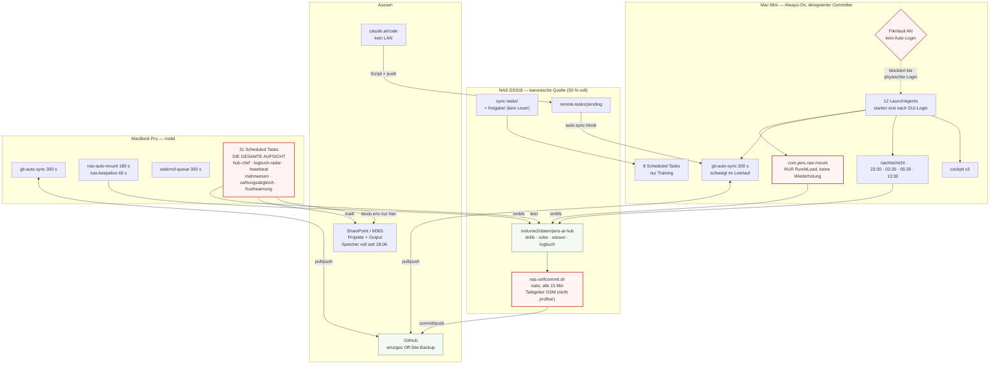

# JANS AI Hub — Architektur- und Betriebs-Audit

Stand 12.08.2026, 23:00 CEST. Erhoben auf dem Mac Mini bei gemountetem NAS
(`//raphaeljans@192.168.1.10/daten on /Volumes/daten (smbfs)`), Gegenstation MacBook Pro
per SSH erreichbar.

## Belegstatus-Legende

Jeder Befund trägt eine Einstufung. Sie ist Teil der Aussage, nicht Beiwerk.

- **BELEGT** — durch Befehlsausgabe, Logzeile oder Dateiinhalt in diesem Lauf nachgewiesen.
  Die Fundstelle steht beim Befund.
- **VERMUTET** — plausibel aus belegten Teilfakten geschlossen, aber nicht direkt gemessen.
- **NICHT PRÜFBAR** — im Rahmen dieses Laufs nicht zugänglich (fehlende Rechte, flüchtige
  Daten, gelöschte Logs). Wird als Lücke ausgewiesen, nicht als Befund verkleidet.

## Vorbedingung und Ausgangsbefunde

`/Volumes/daten` ist gemountet, der Audit lief vollständig. Die beiden geforderten
Vorabprüfungen ergaben ein gesundes Bild:

**Heartbeat (alle 12 Checks):** NAS erreichbar; SSD-Repo clean; M365 per Zertifikat
verbunden (`CN=JANS-AI-Hub-M365-MacMini`, gültig bis 24.03.2028); 1.1 TB frei;
Symlinks intakt; Sync-Kette fliesst (letzter echter Push 22:44:09, 0 Skips seit dem
letzten Commit, NAS und SSD auf demselben HEAD); Trust auf beiden Hub-Pfaden gesetzt;
Grundkontext 97'158 Zeichen bei Schwelle 100'000; Task-Spiegel aktualisiert; Wege-Radar
Exit 0, keine Reparatur nötig.

**Station-Status:** MacBook Pro wach (Uptime 1 Tag 7:28), Status frisch 22:52,
keine Claude-Sessions dort, keine Doppelspurigkeit auf einem gemeinsamen Projekt.
Beide Stationen auf demselben Hub-Commit.

Der Betrieb läuft also im Moment der Messung sauber. Die Befunde dieses Audits betreffen
nicht den Normalbetrieb, sondern das Verhalten des Systems **an seinen Rändern**: beim
Neustart, beim Ausfall einer Station und bei Eingriffen, die neben den vorgesehenen
Bahnen laufen.

---

# Phase 1 — Inventar

## 1.1 Stationen

| Station | Rolle laut Architektur | Gemessener Zustand |
|---|---|---|
| **Mac Mini** (`Macmini.local`, 100.120.219.12) | Always-On, designierter Git-Committer (`~/.jans-git-committer`), Träger der Nachtschicht | Uptime 5:02 h. **Fünf Reboots am 12.08.**: 09:29, 15:58, 17:28, 17:39, 17:49 (`last reboot`) |
| **MacBook Pro** (`Macbookpro.local`, 100.117.99.62) | Mobil, Aushilfe | Uptime 1 Tag 7:28, NAS gemountet, per SSH erreichbar |
| **NAS DS918** (`diskstation918`, 100.92.246.28) | Kanonische Quelle aller geteilten Inhalte, nativer Committer | `/volume2` **5.6 T von 6.1 T belegt, 93 %**, 477 G frei |
| **Cloud** (claude.ai/code) | Kein LAN, arbeitet über `remote-tasks/` | 15 erledigte Remote-Tasks, `pending/` leer; zwei Läufe heute 22:15 und 22:25 |

Verbindungswege gemessen (`hub-setup.mjs --check`): Tailscale verbunden, MacBook Ping OK,
Port 22 offen, `ssh macbook` OK, NAS Ping OK.

## 1.2 Dienste (launchd)

Alle JANS-Dienste sind **LaunchAgents im User-Kontext** (`~/Library/LaunchAgents/`).
`/Library/LaunchDaemons/` und `/Library/LaunchAgents/` enthalten **keinen** JANS-Eintrag.
Diese eine Tatsache trägt einen grossen Teil der Bewertung in Phase 2.

### Mac Mini — 12 geladene Jobs

| Label | Takt | Zweck | Log-Ziel |
|---|---|---|---|
| `com.jans.git-auto-sync` | 300 s, RunAtLoad | Pull/Commit/Push SSD-Repo, ruft Remote-Task-Runner | `/tmp/jans-git-sync-err.log` |
| `com.jans.nas-mount` | **nur RunAtLoad** | `osascript mount volume smb://192.168.1.10/daten` | `/tmp/nas-mount.log` |
| `com.jans.station-status` | 600 s, RunAtLoad | Stations-Status auf NAS schreiben | `/tmp/jans-station-status.err` |
| `ch.jans.synctask-runner` | 1800 s, RunAtLoad | Sync-Task-Queue abarbeiten | `~/Library/Logs/jans-synctask-runner.*.log` |
| `ch.jans.nachtschicht` | 23:30, 02:30, 05:30, 13:30 | KB-Trainingsläufe | `/tmp/ch.jans.nachtschicht.*` |
| `ch.jans.speicher-waechter` | 1800 s, RunAtLoad | Speicherdeckel | keins |
| `ch.jans.wissens-trigger` | 06:30 | Ereignis-Trigger Lern-Loops | keins |
| `ch.jans.transcript-rotation` | So 04:00 | Transkripte rotieren | keins |
| `ch.jans.claude-autoupdate` | 05:15 | Claude-Code-Update | `/tmp/claude-autoupdate.*` |
| `com.jans.cockpit` | 300 s | Cockpit bauen | `/tmp/com.jans.cockpit.err` |
| `com.jans.cockpit-server` | KeepAlive, PID 845 | Cockpit-Backend | `/tmp/com.jans.cockpit-server.*` |
| `com.jans.cockpit-web` | KeepAlive, PID 852 | Cockpit-Webserver | `/tmp/com.jans.cockpit-web.err` |

Daneben liegen **elf abgelöste Plists** als `.bak-*` / `.disabled-*` im selben Verzeichnis
(u.a. `ch.jans.training-energie`, `-normen`, `-plg`, `ch.jans.synobsis-batch`,
`ch.jans.vollgas-supervisor`). Sie sind nicht geladen, aber sie machen das Verzeichnis
schwer lesbar.

### MacBook Pro — 13 geladene Jobs, davon 5 exklusiv

Nur dort vorhanden: `com.jans.nas-auto-mount` (180 s), `com.jans.nas-keepalive` (60 s),
`ch.jans.widerruf-queue` (300 s), `ch.jans.claude-alwayson` (KeepAlive, PID 935 aktiv),
`ch.raphaeljans.cowork.nas`.

Nur auf dem Mini vorhanden: `ch.jans.nachtschicht`, `com.jans.cockpit`,
`com.jans.cockpit-web`, `com.jans.nas-mount`.

## 1.3 Scheduled Tasks (Claude-Code-Registry)

| Station | Anzahl | Inhalt |
|---|---|---|
| **MacBook Pro** | **31** | Die gesamte Aufsicht: `hub-chef-taeglich`, `logbuch-radar`, `heartbeat-daily`, `mahnwesen-verzugscheck`, `zahlungsabgleich-check`, `vollgas-fruehwarnung`, `vollgas-chef-radar`, `wissens-chef`, `ag-gruendung-monitor`, `wissenscheck-monatlich`, `twin-fidelity-review`, `methoden-radar`, `tenant-hygiene-weekly` und 18 weitere |
| **Mac Mini** | **8** | Ausschliesslich Trainings- und Messläufe: `arbeits-weiche-review`, `baurecht-buch-training`, `claude-abo-auslastung`, `energie-training` (`enabled: false`), `grobkosten-training`, `normen-training-mini` (`enabled: false`), `planungsgrundlagen-training`, `synobsis-batch-nacht` |

Der Spiegel unter `templates/scheduled-tasks/` weist selbst darauf hin, dass er Doku ist
und nie Live-Zustand. Das ist keine Formalie: am 08.08.2026 feuerte
`planungsgrundlagen-training` trotz Deaktivierung vom 03.08. (Logbuch, Eintrag
«Mac Mini 16:05, Stale-Fire»).

## 1.4 Connectoren und Auth-Wege

16 Connectoren im Index (`connectors/README.md`). Auth-Artefakte gemessen:

| Auth-Weg | Artefakt | Mac Mini | MacBook Pro |
|---|---|---|---|
| Zertifikat (M365, Graph, MCP) | `~/.cli-m365-cert-combined.pem` | vorhanden, `-rw-------`, bis 24.03.2028 | vorhanden |
| PAT bexio | `~/.bexio.env` | **fehlt** | vorhanden |
| Basic-Auth Zefix | `~/.zefix.env` | **fehlt** | **fehlt** |
| DS3 Truninger | `~/.truninger-ds3.env` | vorhanden, `-rw-------` | vorhanden |
| SSH GitHub | `~/.ssh/id_ed25519` | vorhanden, **ohne Passphrase** | vorhanden |
| SMB NAS | Keychain-Eintrag `192.168.1.10`, Protokoll `smb`, Account `raphaeljans` | vorhanden | (nicht geprüft) |
| Playwright-Session | eBaugesuche ZH, ~10 Tage | laut Register HTTP 401 seit 28.07. offen | — |

Secrets sind sauber aus dem Repo gehalten: `.gitignore` deckt `.env`, `*.env`, `*.secret`,
`*.key`, `*.pem`; `git log --all -- .env` ist leer, die Datei wurde nie committet.

## 1.5 Sync-Wege

Fünf voneinander unabhängige Mechanismen halten den Bestand zusammen:

1. **`nas-selfcommit.sh`** — nativ auf der Synology, alle 15 Min, committet und pusht das
   NAS-Repo. Der einzige erlaubte Git-Schreiber auf `/Volumes/daten/jans-ai-hub/.git`.
   Taktgeber liegt im DSM-Aufgabenplaner (root). *NICHT PRÜFBAR ohne sudo; die Wirkung
   ist belegt: `selfcommit-202608.log` zeigt 22:44:09 push OK und 22:53:13 push OK.*
2. **`com.jans.git-auto-sync`** — alle 300 s auf jeder Station: `git pull --rebase --autostash`,
   `git add -A`, Commit, Push; danach Remote-Task-Hook.
3. **`ch.jans.synctask-runner`** — alle 1800 s: `sync-tasks/<station>/` abarbeiten, vorher
   durch `sync-task-guard.sh`; heikle Tasks nach `sync-tasks/freigabe/<station>/`.
4. **`remote-tasks/`** — Cloud-Sessions legen Shell-Scripts nach `pending/<station>/`,
   der auto-sync-Hook führt sie aus, Ergebnisse nach `results/`.
5. **Cloud-Sync-Dienste** — OneDrive (Projekte, SharePoint-Bibliotheken), Dropbox (215 GB),
   vier Google-Drive-Konten.

## 1.6 Datenflüsse: was kanonisch ist und was Kopie

```
NAS /Volumes/daten/jans-ai-hub    KANONISCH  skills, agents, rules, commands, wissen, scripts,
                                             templates, docs, logbuch, sync-tasks
  → GitHub                        BACKUP     einziges Off-Site, Push nur vom NAS und den Stationen
  → ~/Developer/jans-ai-hub       SPIEGEL    Lese-Klon; hier NIE geteilte Inhalte editieren
      → .claude/{skills,agents,commands}  SYMLINK zurück aufs NAS
      → .claude/worktrees/*       5 verwaiste Worktrees, 08.05. bis 09.07.

SharePoint / OneDrive             KANONISCH  Projekte, PROJEKT-STAND.md, Output-Ablage
  → OneDrive-FreigegebeneBibliotheken–JANS/   der eine gültige Pfad (15 Einträge)
  → drei weitere OneDrive-Wurzeln, davon zwei leere Namensraum-Leichen

~/.claude/scheduled-tasks/        KANONISCH  Live-Wecker, ausserhalb Git
  → templates/scheduled-tasks/    SPIEGEL    Doku, ausdrücklich nicht Live-Zustand
```

## 1.7 Architekturdiagramm, Ist-Zustand



---

# Phase 2 — Bewertung

## 2.1 Neustart-Festigkeit: was einen Mac-Mini-Reboot nicht überlebt

### Die tatsächliche Kette, gemessen

Der Auftrag nennt als Prüffall «gesperrter Schlüsselbund → Git-Sync stumm». Die Messung
zeigt eine **andere und ernstere** Kette. Der Unterschied ist wichtig, weil er die
Gegenmassnahme verändert.

**Was nicht zutrifft (BELEGT):** Der GitHub-Zugang hängt nicht am Schlüsselbund.
`~/.ssh/id_ed25519` ist **ohne Passphrase** gespeichert (Header `...bm9uZQAAAARub25l...`,
also Cipher `none` und KDF `none`; `ssh-keygen -y -P ""` gelingt). Der Push funktioniert
damit auch ohne entsperrten Keychain und ohne ssh-agent. Passend dazu: der im Plist
gesetzte `SSH_AUTH_SOCK=/Users/raphaeljans/.ssh/agent.sock` zeigt auf eine Datei, die
**nicht existiert** (`ls` → No such file or directory). Der Eintrag ist damit wirkungslos.

**Was tatsächlich zutrifft (BELEGT):**

1. `fdesetup status` → **«FileVault is On.»**
2. `defaults read /Library/Preferences/com.apple.loginwindow autoLoginUser` → Eintrag
   existiert nicht, also **kein Auto-Login** (mit FileVault auch nicht sinnvoll setzbar).
3. **Alle 12 JANS-Jobs sind LaunchAgents im User-Kontext.** In `/Library/LaunchDaemons/`
   liegt kein einziger JANS-Eintrag.

Daraus folgt zwingend: **Nach einem Stromausfall oder einem erzwungenen Neustart bleibt der
Mac Mini am FileVault-Prompt stehen.** Es startet kein Dienst, kein Mount, keine Nachtschicht,
kein Sync und kein Scheduled Task, bis jemand physisch am Gerät ein Passwort eingibt.
Screen Sharing hilft nicht, weil es selbst erst nach dem Login verfügbar ist. Die Station,
die die Architektur als «Always-On» führt, ist damit genau so verfügbar wie die Anwesenheit
einer Person.

Der 12.08. liefert das Anschauungsmaterial: **fünf Reboots** zwischen 09:29 und 17:49
(`last reboot`). Dass laufende Sessions dabei abrissen, folgt unmittelbar; welche konkret,
ist nicht mehr rekonstruierbar (VERMUTET für die einzelnen Sessions, BELEGT für die Reboots).

### Was der Reboot ausserdem zerstört

**Alle Job-Logs liegen in `/tmp` (BELEGT).** Sämtliche `StandardOutPath`/`StandardErrorPath`
der Mini-Jobs zeigen dorthin. `/tmp/nas-mount.log`, `/tmp/nas-mount-error.log` und
`/tmp/jans-git-sync-err.log` tragen alle den Zeitstempel **12. Aug 17:50**, also die Boot-Zeit.
Damit ist die Ursachenanalyse eines Absturzes strukturell unmöglich: genau die Zeilen, die
erklären würden, warum der Rechner neu startete, sind der erste Kollateralschaden des
Neustarts.

**Kein Nachhol-Mechanismus (BELEGT).** Eine Suche nach `stale-fire`, `nachhol`, `verpasst`
und `missed` in `scripts/` liefert einen einzigen, unverwandten Treffer. Ein Scheduled Task,
der während eines Ausfalls fällig war, fällt ersatzlos aus.

### Die Log-Lücke vom 11./12.08. richtig gelesen

`.git/auto-sync.log` zeigt eine Lücke von **11.08. 05:19:45 bis 12.08. 18:01:31**, danach
`SKIP: GitHub nicht erreichbar`, dann erst 22:15:34 wieder ein `PULL`.

Diese Lücke ist **kein Beweis** für einen Ausfall des auto-sync (BELEGT durch Codelektüre):
`scripts/git-auto-sync.sh:55-59` schreibt bei «Already up to date» **nichts**. Da der
NAS-Committer im selben Zeitraum 41 Stunden stillstand (verwaister Rebase-Rest, Chronik
260812), gab es schlicht nichts zu holen. Die Stille ist erklärbar.

**Genau das ist der Befund.** Ein Mechanismus, der im Leerlauf schweigt, macht seinen eigenen
Totalausfall unsichtbar: ein toter Job und ein ruhiger Tag sehen im Log identisch aus.
Dasselbe gilt für den Sync-Task-Runner (`scripts/sync-task-run.sh:105`:
`[ ${#TASKS[@]} -eq 0 ] && exit 0`, stiller Ausstieg ohne Logzeile). Sein
`runner-202608.log` endet am **07.08. 21:29**, bei einem 30-Minuten-Takt. Ob er seither
läuft, ist aus dem Log nicht entscheidbar.

Das ist dieselbe Fehlerfamilie, die heute beim `nas-selfcommit` geschlossen wurde. Die
Chronik 260812 formuliert sie treffend: «zuerst fragen, was ein Lebenszeichen wirklich
bezeugt». Die Härtung erfasste einen von drei betroffenen Mechanismen.

## 2.2 Single Points of Failure und stille Ausfälle

### SPOF 1 — Der Ausfall einer Station wird von niemandem bemerkt

`station-status.sh` **schreibt** den Zustand alle 600 s auf das NAS. Es gibt **keinen Leser,
der die Frische prüft** (BELEGT): eine Suche nach `station-status` in `scripts/`, `skills/`
und `commands/` liefert nur das Script selbst, das Setup-Dokument und den interaktiven
Slash-Command. `skills/hub-chef/SKILL.md` enthält keinen Treffer auf `station-status`,
`stale`, `veraltet` oder `erreichbar`. Die drei vorhandenen Wächter
(`kontingent-waechter.sh`, `speicher-waechter.sh`, `vollgas-monitor-build.sh`) messen
Ressourcen der **eigenen** Station.

Fällt der Mini aus, schreibt er keinen Status mehr, und niemand vermisst ihn.

### SPOF 2 — Die gesamte Aufsicht läuft auf der mobilen Station

31 der 39 Scheduled Tasks liegen auf dem MacBook Pro, darunter **jeder** Melde- und
Kontrollkanal: Tagesbriefing, Fristen-Radar, Heartbeat, Mahnwesen, Zahlungsabgleich,
Kontingent-Frühwarnung, Wissens-Chef. Der Mini trägt acht reine Trainingsläufe.

Die Architektur hat die Rollen vertauscht: Die Arbeit liegt auf der zuverlässigen Station,
die Aufsicht auf der unzuverlässigen. Verschärfend kommt die Wechselseitigkeit hinzu:
fällt das MacBook aus, fällt die Aufsicht über den Mini mit aus, und der Mini bemerkt es
nicht (SPOF 1). Es gibt keinen Punkt im System, an dem der Ausfall des jeweils anderen
sichtbar würde.

Auch die Reparaturwege hängen daran: `ch.jans.widerruf-queue`, die Umsetzung des
Widerrufsfensters aus der Whitelist v2, läuft **nur** auf dem MacBook. Erzeugt der Mini eine
Aussenwirkung mit Widerrufsfenster, verarbeitet die Queue niemand, solange das MacBook
geschlossen ist (VERMUTET; das Zusammenspiel wurde nicht durchgespielt).

### SPOF 3 — Der NAS-Mount auf dem Mini kennt keine Wiederherstellung

`com.jans.nas-mount.plist` hat `RunAtLoad`, aber **kein `StartInterval`**: er läuft genau
einmal pro Login. Der Befehl selbst ist ein `osascript` mit `try ... end try`, das jeden
Fehler verschluckt und nach `/tmp/nas-mount.log` genau ein Wort schreibt (`file daten:`).

Das MacBook Pro besitzt für denselben Zweck **zwei** Jobs: `com.jans.nas-auto-mount` alle
180 s und `com.jans.nas-keepalive` alle 60 s. Die belastbarere Lösung existiert also bereits
und liegt auf der falschen Station.

Bricht der Mount auf dem Mini weg, arbeiten Nachtschicht, Trainings-Tasks und
Sync-Task-Runner gegen leere Pfade weiter, ohne Meldung.

### SPOF 4 — Zwei Connectoren sind stationsgebunden oder tot

`~/.bexio.env` liegt ausschliesslich auf dem MacBook Pro. Jede bexio-gestützte Arbeit
(`mahnwesen`, `zahlungsabgleich`, `kostenkontrolle`, der bexio-Teil des `hub-chef`) ist
damit an die mobile Station gebunden. `~/.zefix.env` fehlt auf **beiden** Stationen: der
Zefix-Connector steht im Werkzeug-Index und in der Wege-Logik, ist aber unbenutzbar.

### SPOF 5 — Speicher an zwei Stellen nahe der Grenze

NAS `/volume2`: **93 % belegt**, 477 G frei (`df -h`). SharePoint: seit 18.06.2026 als voll
gemeldet (`logbuch/fristen.md:1053`, «1055.04 / 1054 GB», Status offen). Der SharePoint-Wert
stammt aus dem Register, nicht aus einer Live-Messung dieses Laufs (BELEGT als
Registereintrag, aktueller Stand NICHT PRÜFBAR ohne eigene Abfrage).

Beide sind Ziel des täglichen Output-Flusses. Läuft eines voll, scheitern Ablage und
Commit gleichzeitig.

### SPOF 6 — `station-status` blockiert an einem `find` über OneDrive

Während des Audits lief `station-status.sh write` in den 120-Sekunden-Timeout. Ursache
gemessen: PID 13193,
`find .../OneDrive-FreigegebeneBibliotheken–JANS/AR - 01 Projekte -type f -mmin -720`,
Laufzeit **6:07 Minuten** und weiter. Die Stelle ist `scripts/station-status.sh:64`.

Zwei Probleme in einer Zeile: Der Job läuft alle 600 s, ein Lauf kann länger dauern als
sein Takt (Überlappung ohne Lock). Und das Glob `"$od"/OneDrive*/AR*` trifft **alle**
OneDrive-Wurzeln, auch die zwei leeren Namensraum-Leichen aus 2.3.

## 2.3 Schutzlücken: was der Guard nicht abdeckt

### Lücke 1 — Der Guard schützt nur einen einzigen Kanal

`sync-task-guard.sh` prüft **Sync-Tasks**. Er greift nicht bei interaktiven Sessions, nicht
bei Nachtschicht-Läufen, nicht bei Remote-Tasks aus der Cloud und nicht bei manueller
Arbeit an der Kommandozeile. Genau die riskantesten Eingriffe laufen aber typischerweise
interaktiv, weil sie ad hoc entstehen.

### Lücke 2 — Der OneDrive-Eingriff vom 08.08.2026, Beleg für Lücke 1

`~/OneDrive-Quarantaene-260808` enthält **2.8 GB** und wurde am 08.08. zwischen 17:47 und
20:41 angelegt (`ls -la`). Darin liegen:

- `fileprovider-store/` und `domainscache.plist-260808`: Systeminterna des macOS-FileProviders
- **echte Projektdaten**: `JANS - AR - 01 Projekte`, `JANS - IMMO - 01 JANS Bewertung`,
  `JANS - IMMO - 02 UBS FS` **und** `JANS - IMMO - 02 UBSFS` (zwei Varianten desselben
  Ordners, die zweite vom 07.08.), vier weitere IMMO-Ordner, zwei Projekt-Bibliotheken
- vier Symlinks auf mehrfach verdoppelte CloudStorage-Pfade

Der Reststand im Namensraum ist bis heute sichtbar: Neben dem gültigen
`OneDrive-FreigegebeneBibliotheken–JANS/` (15 Einträge) existieren
`OneDrive-FreigegebeneBibliotheken–OneDrive-FreigegebeneBibliotheken–OneDrive-FreigegebeneBibliotheken–JANS2/`
und dieselbe Kette mit einer vierten Verdoppelung und dem Suffix « 2», beide **leer**.

**Der entscheidende Befund ist nicht der Eingriff, sondern seine Unsichtbarkeit.** Eine
Volltextsuche über `rules/`, `logbuch/` und `docs/` nach «OneDrive-Quarantaene» und
«260808» liefert **keinen einzigen Eintrag**. Die einzigen Treffer im ganzen Hub sind zwei
Remote-Task-Scripts von **heute** (`remote-tasks/done/20260812-onedrive-status-check*.sh`),
die den Ordner lediglich auf Existenz prüfen. Weder `logbuch/LOGBUCH.md` noch
`logbuch/fristen.md` noch `rules/betrieb-chronik.md` kennen den Vorgang.

Damit gilt: Der riskanteste Eingriff der vergangenen Woche (Chirurgie am Namensraum des
Systems, das die gesamte Projektablage trägt, mit 2.8 GB verschobener Projektdaten) lief
ohne Guard, ohne Freigabe, ohne Chronikeintrag und ohne Fristen-Registerzeile. Er ist heute
nur noch daran erkennbar, dass ein Ordner im Home-Verzeichnis liegt.

Ob die quarantänierten Daten vollständig in der Cloud vorhanden sind, wurde in diesem
Lauf **nicht** verifiziert (NICHT PRÜFBAR ohne Abgleich gegen SharePoint). Die zwei
Varianten `UBS FS` / `UBSFS` legen nahe, dass mindestens ein Ordner in zwei Ständen
existiert (VERMUTET).

### Lücke 3 — Die Freigabe-Queue hat keinen Leser

`sync-tasks/freigabe/macbook-pro/20260811-230347_NAS-Committer-entsperren...md` liegt seit
**11.08. 23:03**, also knapp 24 Stunden. Die Chronik 260812 benennt das Problem selbst
(«eine Freigabe-Queue, die niemand liest, ist ein Wartezimmer ohne Arzt») und lässt es
ausdrücklich offen. Der Task ist inzwischen gegenstandslos, aber niemand räumt ihn weg,
und beim nächsten echten Fall wiederholt sich der Ablauf.

Die Wirkung ist paradox: Der Guard funktionierte fehlerfrei, und **gerade deshalb** stand
die Sync-Kette 41 Stunden. Ein Schutz, dessen Ausgang niemand kontrolliert, verwandelt jede
heikle Störung in eine Störung von unbestimmter Dauer.

### Lücke 4 — Die Scheduled-Task-Registry ist von den Sessions aus nicht steuerbar

Belegt im Logbuch (08.08., «Stale-Fire»): Die Deaktivierung vom 03.08. setzte nur den
Beschreibungstext, nicht den App-internen Scheduler-Eintrag; die Task feuerte weiter.
`templates/scheduled-tasks/README.md` erklärt den Spiegel selbst zur Doku ohne
Live-Anspruch, und Rule `modellwahl-routine` Ziffer 4 hält fest, dass auch das Feld
`model:` keine gemessene Wirkung hat.

Damit existiert eine Klasse von Konfiguration, die dokumentiert werden kann, aber nicht
steuerbar und nicht prüfbar ist. Jede Aussage über den Takt des Systems steht unter
diesem Vorbehalt.

## 2.4 Doppelspurigkeiten und unnötige Komplexität

### Fünf Sync-Mechanismen für eine Aufgabe

`nas-selfcommit`, `git-auto-sync`, `synctask-runner` mit Commit-Anfragen, `remote-tasks`,
dazu die Cloud-Sync-Dienste. Jeder hat seine Berechtigung, aber die Zahl der Zustände,
in denen sie sich gegenseitig blockieren können, wächst quadratisch. Der Vorfall
11./12.08. ist genau so entstanden: `git-auto-sync` erzeugte mit `pull --rebase --autostash`
den Rebase-Rest, den `nas-selfcommit` als echten Rebase deutete und 178 Mal umging.

### Der Nachtschicht-Guard ist Prosa statt Code

`scripts/nachtschicht-run.sh:126` ist **ein einziger Absatz von rund 4'000 Zeichen**, der die
Ziel-Auswahl der Lern-Loops regelt. Er enthält verschachtelt: eine Ausschlussliste mit vier
KBs samt Begründung, eine «RUECKNAHME 05.08.2026» für `projekt-lessons`, eine «KORREKTUR
04.08.2026», die eine früher genannte Begründung widerruft, Wiederaufnahmebedingungen und
den Hinweis, im Zweifel die Registry nicht selbst abzufragen.

Diese Logik ist real und richtig hergeleitet. Aber sie ist als Fliesstext im Prompt nicht
testbar, nicht diffbar und nicht maschinell prüfbar. Jede weitere Korrektur verlängert den
Absatz. Der «Doppelarbeit-Guard» im selben Abschnitt trägt bereits den Vermerk «KORRIGIERT
29.07.2026», weil eine dort behauptete zweite Schicht seit dem 29.07. nicht mehr existiert.

### Elf abgelöste Plists und fünf verwaiste Worktrees

`~/Library/LaunchAgents/` trägt elf `.bak-*`/`.disabled-*`-Dateien neben den zwölf aktiven.
`git worktree list` zeigt fünf Worktrees unter `.claude/worktrees/` (08.05. bis 09.07.,
vier davon detached HEAD, zusammen 792 K). Der Schaden ist gering, aber Rule
`sync-kanonische-quelle` verbietet ausdrücklich Edits in Worktrees: jeder stehengelassene
Worktree ist eine Falle für die nächste Session, die ihn zufällig öffnet.

### Regel und Praxis divergieren beim auto-sync

Rule `git-auto-push.md` schreibt vor: «`git add <spezifische Dateien>` (keine `-A`, keine
`.`)». `scripts/git-auto-sync.sh:67` führt `git add -A` aus. Da `.gitignore` alle
Secret-Muster abdeckt und `.env` nachweislich nie committet wurde, ist das **kein akutes
Sicherheitsrisiko**, aber es ist eine Regel, die im laufenden Betrieb nicht gilt, und
solche Regeln erodieren die Verbindlichkeit der übrigen.

### Git-Identität nicht gesetzt

`git config user.name` und `user.email` sind weder lokal noch global gesetzt. Jeder
auto-sync-Commit erzeugt die Git-Warnung «Your name and email address were configured
automatically» (im Log mitprotokolliert) und trägt `raphaeljans@Macmini.local`. Kosmetisch,
aber es verrauscht das Log und erschwert die Zuordnung in der History.

---

# Risikoliste

Sortiert nach Schadenserwartung. Jeder Eintrag nennt vier Dinge: die **Fundstelle**, an der
der Befund nachprüfbar ist, das **Szenario**, das ihn auslöst, das **Schadensbild** und den
**Belegstatus**. Blockform statt Tabelle, weil eine sechsspaltige Tabelle im A4-Hochformat
Wörter mitten im Wort trennt (Rule `dokument-layout-standard`).

**R1 — Mac Mini startet nach einem Reboot nicht selbständig durch** · BELEGT
Fundstelle: `fdesetup status` = «FileVault is On»; `autoLoginUser` nicht gesetzt; alle 12 Jobs
in `~/Library/LaunchAgents/`; `last reboot` mit 5 Neustarts am 12.08.
Szenario: Stromausfall, macOS-Update oder Kernel-Panic in Abwesenheit.
Schaden: Nachtschicht, 8 Trainings-Tasks, Sync, Mount und Cockpit stehen bis zum physischen
Login. Bei Abwesenheit tagelang.

**R2 — Der Ausfall einer Station wird von niemandem bemerkt** · BELEGT
Fundstelle: kein Leser der Dateien `station-status/*.md`; `skills/hub-chef/SKILL.md` ohne
Frische-Prüfung.
Szenario: R1 tritt ein, oder das MacBook bleibt zu.
Schaden: Der Ausfall wird erst beim nächsten manuellen Blick entdeckt. Fristen laufen
unbeobachtet weiter.

**R3 — Die gesamte Aufsicht läuft auf der mobilen Station** · BELEGT
Fundstelle: `templates/scheduled-tasks/` mit 31 Tasks auf dem MacBook gegen 8 auf dem Mini.
Szenario: MacBook geschlossen, unterwegs oder Akku leer.
Schaden: Kein Tagesbriefing, kein Fristen-Radar, kein Mahnwesen, keine
Kontingent-Frühwarnung. Zugleich ist R2 blind.

**R4 — Riskante Eingriffe laufen ausserhalb des Guards und hinterlassen keine Spur** · BELEGT
Fundstelle: `~/OneDrive-Quarantaene-260808` mit 2.8 GB; kein einziger Treffer in `rules/`,
`logbuch/` und `docs/`.
Szenario: interaktive Reparatur an Cloud-Sync, FileProvider, Keychain oder Systemdiensten.
Schaden: Datenverlust oder Divergenz ohne Rekonstruktionsmöglichkeit. Zwei Varianten
desselben OneDrive-Ordners liegen bereits vor.

**R5 — Ein Log ist kein Lebenszeichen** · BELEGT
Fundstelle: `scripts/git-auto-sync.sh:55-59`; `scripts/sync-task-run.sh:105`;
`runner-202608.log` endet am 07.08. bei 30-Minuten-Takt.
Szenario: ein Job stirbt oder wird nie geladen.
Schaden: Der Totalausfall sieht aus wie ein ruhiger Tag. Erkennung erst über den
Folgeschaden.

**R6 — Der NAS-Mount auf dem Mini kennt keine Wiederherstellung** · BELEGT
Fundstelle: `com.jans.nas-mount.plist` mit RunAtLoad, ohne Intervall, mit `try … end try`;
das MacBook hat für dieselbe Aufgabe zwei Jobs.
Szenario: SMB-Timeout, NAS-Neustart, Netzwerkunterbruch.
Schaden: Nachtschicht und Loops arbeiten gegen leere Pfade weiter, ohne Meldung.

**R7 — Die Freigabe-Queue hat keinen Leser** · BELEGT
Fundstelle: `sync-tasks/freigabe/macbook-pro/20260811-230347_NAS-Committer-entsperren…md`,
24 Stunden alt; Chronik 260812.
Szenario: der Guard hält einen Task korrekt zurück.
Schaden: Die Störung verlängert sich unbegrenzt. Real eingetreten: 41 Stunden
Sync-Stillstand.

**R8 — Speicher an zwei Stellen nahe der Grenze** · BELEGT für das NAS, Registereintrag für SharePoint
Fundstelle: `df -h /volume2` mit 93 %; `logbuch/fristen.md:1053` für SharePoint, seit
18.06. offen.
Szenario: normales Wachstum der Loop-Ausgaben.
Schaden: Commit und Output-Ablage scheitern gleichzeitig, die Loops schreiben ins Leere.

**R9 — Post-mortem unmöglich, weil die Logs in `/tmp` liegen** · BELEGT
Fundstelle: alle `StandardErrorPath` der Mini-Jobs; Zeitstempel 12. August 17:50, also
die Boot-Zeit.
Szenario: jeder unerklärte Neustart.
Schaden: Die Ursache ist nicht rekonstruierbar, derselbe Fehler wiederholt sich.

**R10 — `station-status` blockiert an einem `find` über OneDrive** · BELEGT
Fundstelle: `scripts/station-status.sh:64`; PID 13193 mit 6:07 Minuten Laufzeit bei einem
Takt von 600 s.
Szenario: OneDrive materialisiert Dateien oder hängt.
Schaden: überlappende Läufe, veralteter Status, zusätzliche Last. Verschärft R2.

**R11 — Die Scheduled-Task-Registry ist nicht steuerbar, die Doku divergiert** · BELEGT
Fundstelle: Logbuch 08.08. «Stale-Fire»; `templates/scheduled-tasks/README.md`; Rule
`modellwahl-routine`, Ziffer 4.
Szenario: eine Task deaktivieren, ein Modell setzen, einen Takt ändern.
Schaden: Die Änderung wirkt nicht, gilt aber als erledigt. Kosten und Läufe laufen weiter.

**R12 — bexio nur auf einer Station, Zefix auf keiner** · BELEGT
Fundstelle: `~/.bexio.env` fehlt auf dem Mini, `~/.zefix.env` fehlt auf beiden Stationen.
Szenario: Debitoren-Arbeit vom Mini aus, oder eine Firmenprüfung.
Schaden: Die bexio-Skills scheitern auf dem Mini. Der Zefix-Connector ist unbenutzbar,
obwohl er im Werkzeug-Index steht.

**R13 — Fünf Sync-Mechanismen blockieren sich gegenseitig** · BELEGT
Fundstelle: Chronik 260811 und 260812. Das `pull --rebase --autostash` erzeugt den Rest,
den `nas-selfcommit` danach 178 Mal umgeht.
Szenario: gleichzeitiger Zugriff zweier Mechanismen.
Schaden: Sync-Stillstand mit uncommitteter Loop-Arbeit. Real eingetreten: 44 Dateien aus
1.5 Tagen.

**R14 — Steuerungslogik steht als Prosa im Prompt** · BELEGT
Fundstelle: `scripts/nachtschicht-run.sh:126`, rund 4'000 Zeichen mit eingebetteten
Korrekturen und Rücknahmen.
Szenario: jede weitere Takt-Entscheidung.
Schaden: nicht testbar, nicht diffbar. Widersprüche fallen erst im Lauf auf.

**R15 — Regel und Praxis divergieren beim `git add -A`** · BELEGT
Fundstelle: Rule `git-auto-push.md` gegen `scripts/git-auto-sync.sh:67`.
Szenario: eine neue, noch nicht ignorierte Datei im Repo.
Schaden: kein akutes Secret-Risiko, da `.gitignore` alle Muster deckt und `.env` nie
committet wurde. Es erodiert aber die Verbindlichkeit der übrigen Rules.

**R16 — Verwaiste Worktrees und tote Plists** · BELEGT
Fundstelle: `git worktree list` mit 5 Einträgen ab 08.05.; 11 `.bak`- und
`.disabled`-Plists.
Szenario: eine Session öffnet zufällig einen Worktree.
Schaden: Edit am falschen Ort, entgegen Rule `sync-kanonische-quelle`.

**R17 — Die Git-Identität ist nicht gesetzt** · BELEGT
Fundstelle: `git config user.name` ist leer, lokal wie global; Warnung in `auto-sync.log`.
Szenario: jeder auto-sync-Commit.
Schaden: Das Log verrauscht, die Zuordnung in der History wird erschwert.

---

# Massnahmen

Priorisiert nach Nutzen je Aufwand. Jede Massnahme nennt den konkreten Umsetzungsort.
**Keine davon wurde in diesem Lauf ausgeführt**: der Auftrag war ein Audit, und mehrere
Massnahmen berühren Persistenz, Systemdienste und Freigabe-Mechanik.

## Priorität A — hoher Nutzen, kleiner Aufwand

**A1 — Wechselseitiger Stations-Watchdog** *(gegen R1, R2, R3)*
Ein Script `scripts/stationen-watchdog.sh` liest `station-status/<gegenstation>.md`, vergleicht
den Zeitstempel mit der Gegenwart und meldet ab einer Schwelle (Vorschlag: 60 Min für den
Mini, 24 h für das MacBook, weil mobil). Einhängen an zwei Stellen: als Check 13 im Skill
`heartbeat` und als Pflichtzeile im Tagesbriefing des Skills `hub-chef`. Zusätzlich ein
LaunchAgent `ch.jans.stationen-watchdog` auf **beiden** Stationen (Intervall 1800 s), damit
die Erkennung nicht selbst an der ausgefallenen Station hängt. Aufwand: ein halber Tag.

**A2 — Lebenszeichen statt Stille** *(gegen R5)*
In `scripts/git-auto-sync.sh` nach Zeile 59 und in `scripts/sync-task-run.sh` vor Zeile 105
je eine Herzschlag-Zeile schreiben (`OK: nichts zu tun`), aber nur einmal pro Stunde, damit
das Log nicht zuläuft. Alternativ eine `touch`-Datei je Job unter
`logbuch/heartbeat/<job>.stamp`, deren Alter A1 mitprüft. Die zweite Variante ist sauberer,
weil sie den Puls vom Inhalt trennt. Aufwand: zwei Stunden.

**A3 — Job-Logs aus `/tmp` herausnehmen** *(gegen R9)*
`StandardOutPath`/`StandardErrorPath` aller zwölf Mini-Plists auf
`~/Library/Logs/jans/<label>.log` umstellen, dazu eine Rotation im bestehenden
`ch.jans.transcript-rotation`. Damit überlebt die Fehlerursache den Neustart.
Aufwand: eine Stunde. **Berührt LaunchAgents, also Freigabe-pflichtig.**

**A4 — NAS-Mount auf dem Mini nachziehen** *(gegen R6)*
Die auf dem MacBook bereits bewährten Jobs `com.jans.nas-auto-mount` (180 s) und
`com.jans.nas-keepalive` (60 s) auf den Mac Mini übernehmen und `com.jans.nas-mount`
ersetzen. Der Code existiert (`scripts/ensure-nas-mounted.sh`, `scripts/nas-keepalive.sh`
sind im Repo). Aufwand: eine Stunde. **Freigabe-pflichtig (Persistenz).**

**A5 — Freigabe-Queue im Tagesbriefing** *(gegen R7)*
Skill `hub-chef` um eine Pflichtzeile ergänzen: jede Datei in `sync-tasks/freigabe/**`, die
älter als 12 h ist, erscheint im Briefing mit Alter und Titel. Die Chronik 260812 schlägt
das bereits vor, es ist nur nicht gebaut. Zusätzlich in `sync-tasks/README.md` festhalten,
wer die Queue liest. Aufwand: eine Stunde.

**A6 — `find` in `station-status.sh` entschärfen** *(gegen R10)*
Zeile 64: Glob auf den einen gültigen Pfad einschränken statt `OneDrive*`, ein
`-maxdepth 4` setzen und den Aufruf mit einer Zeitbegrenzung versehen. Zusätzlich ein
Lock analog zu `sync-task-run.sh:74`, damit sich Läufe nicht überlappen.
Aufwand: eine Stunde.

**A7 — Git-Identität setzen** *(gegen R17)*
`git config --global user.name "Raphael Jans"` und
`git config --global user.email "rj@raphaeljans.ch"` auf beiden Stationen.
Aufwand: fünf Minuten.

**A8 — Takt-Aussagen nachmessen statt dokumentieren** *(gegen R11)*
Für die nicht steuerbare Scheduled-Task-Registry gibt es keine technische Lösung von der
Session aus. Was es gibt, ist eine Beweispflicht. Ein Script
`scripts/task-takt-nachweis.sh` liest `logbuch/laeufe/*.jsonl` und listet je Task den
letzten tatsächlichen Lauf; die Differenz zwischen behauptetem Takt (aus dem Spiegel) und
gemessenem Lauf ist der Befund. Einhängen in den Skill `heartbeat` und in den bestehenden
Task `arbeits-weiche-review`. Ergänzend eine Zeile in Rule `modellwahl-routine`, die den
Grundsatz verallgemeinert: eine Takt- oder Deaktivierungsänderung gilt erst als erledigt,
wenn der ausbleibende beziehungsweise erfolgte Lauf gemessen ist. Aufwand: ein halber Tag.

## Priorität B — hoher Nutzen, mittlerer Aufwand

**B1 — Aufsicht auf die Always-On-Station verlegen** *(gegen R3)*
Die Melde- und Kontroll-Tasks `hub-chef-taeglich`, `logbuch-radar`, `heartbeat-daily`,
`mahnwesen-verzugscheck`, `zahlungsabgleich-check`, `vollgas-fruehwarnung` und
`vollgas-chef-radar` vom MacBook Pro auf den Mac Mini umziehen. Vorbedingung ist A4 und der
Umzug von `~/.bexio.env` (siehe B3). Der Umzug muss in der Claude-Code-App erfolgen, weil die
Registry von Sessions aus nicht steuerbar ist (R11). Das ist Handarbeit, aber einmalig.
Die Trainings-Tasks bleiben, wo sie sind. Aufwand: ein halber Tag, davon der grössere Teil
Nachmessen, dass die Tasks am neuen Ort wirklich feuern.

**B2 — Neustart-Festigkeit entscheiden** *(gegen R1)*
Hier gibt es keine kostenlose Lösung, sondern eine Abwägung, die Raphael treffen muss.
Drei gangbare Wege:

- **FileVault auf dem Mini abschalten.** Der Mini steht im Büro, die kritischen Daten
  liegen auf dem NAS und in M365, nicht auf seiner Platte. Danach trägt ein
  `autoLoginUser`-Eintrag den Rechner bis zur Desktop-Session, und alle LaunchAgents starten.
  Sicherheitsabwägung: physischer Zugriff auf das Gerät würde die lokale Platte lesbar
  machen. Aufwand: 30 Minuten.
- **Die kritischen Jobs zu LaunchDaemons machen** (`/Library/LaunchDaemons/`, `root`). Sie
  starten dann vor dem Login. Das löst FileVault **nicht**: der Rechner bleibt trotzdem am
  Prompt stehen. Nur sinnvoll in Kombination mit dem ersten Weg.
- **`sudo fdesetup authrestart` als Standard für geplante Neustarts** verwenden. Das hilft
  bei bewussten Reboots (also den fünf von heute), nicht beim Stromausfall.

Empfehlung: Weg eins plus A4, weil er als einziger den Stromausfall abdeckt. Umsetzungsort:
`scripts/workstation-setup` bzw. der Skill `workstation-setup`, dazu ein Eintrag in
`rules/betrieb-chronik.md`.

**B3 — Credentials vereinheitlichen** *(gegen R12)*
`~/.bexio.env` auf den Mac Mini bringen (Voraussetzung für B1), `~/.zefix.env` neu
beschaffen oder den Zefix-Connector aus `connectors/README.md` und `connectors/WEGE.md`
als «Zugang fehlt» kennzeichnen. Ergänzend: `scripts/wege-doctor.sh` um eine Prüfung
erweitern, die je Connector das Vorhandensein seines Auth-Artefakts meldet. Dann fällt
eine fehlende Datei beim nächsten Wege-Radar auf, nicht erst beim Einsatz.
**Secrets nie ins Repo**, Übertragung von Hand. Aufwand: eine Stunde.

**B4 — Schutzschwelle auf riskante Eingriffe ausdehnen** *(gegen R4)*
Der Kern des OneDrive-Befunds ist nicht, dass der Eingriff falsch war, sondern dass er keine
Spur hinterliess. Zwei Bausteine:

- **Meldepflicht statt Guard.** Eine neue Rule (Vorschlag `rules/eingriffs-protokoll.md`,
  importiert) verpflichtet **jede** Session, die an Cloud-Sync-Namensräumen, FileProvider,
  Keychain, launchd oder Systemdiensten arbeitet, im selben Lauf einen datierten Eintrag in
  `rules/betrieb-chronik.md` **und** eine Zeile in `logbuch/fristen.md` zu setzen, samt Pfad
  des quarantänierten Materials und der Frage, was noch zu prüfen ist. Das ist billiger als
  ein Guard und deckt alle Kanäle ab, auch die interaktiven.
- **Guard-Muster ergänzen.** In `scripts/sync-task-guard.sh` die Muster um
  `CloudStorage`, `FileProvider`, `fileprovider`, `domainscache`, `security ` (Keychain),
  `fdesetup`, `launchctl` und `defaults write /Library` erweitern. Nach der Lehre aus
  Chronik 260811 jedes neue Muster einmal relativ und einmal über `ssh` durchdenken.
  Aufwand: ein halber Tag.

**B5 — OneDrive-Namensraum abschliessend bereinigen** *(gegen R4)*
Erst prüfen, dann räumen. Schritt eins: Abgleich der 2.8 GB in
`~/OneDrive-Quarantaene-260808` gegen SharePoint, insbesondere die zwei Varianten
`JANS - IMMO - 02 UBS FS` und `UBSFS`. Schritt zwei: die zwei leeren, verdoppelten
CloudStorage-Wurzeln entfernen. Schritt drei: Chronikeintrag nachtragen, damit der Vorgang
vom 08.08. dokumentiert ist. **Nicht unbeaufsichtigt, nicht als Sync-Task**: dieser Eingriff
gehört interaktiv, mit Raphael am Bildschirm. Aufwand: zwei Stunden.

## Priorität C — mittlerer Nutzen, grösserer Aufwand

**C1 — Sync-Wege reduzieren** *(gegen R13)*
Der Vorfall 11./12.08. entstand am Zusammentreffen von `git-auto-sync` (`pull --rebase
--autostash`) und `nas-selfcommit`. Zu prüfen: ob der auto-sync auf dem **Mini** überhaupt
`--autostash` braucht, oder ob `--ff-only` mit sauberem Abbruch genügt. Umsetzungsort
`scripts/git-auto-sync.sh:45`. Vorher die Chronik 260811/260812 lesen, es gibt eine
Vorgeschichte. Aufwand: ein Tag inklusive Test beider Fälle.

**C2 — Nachtschicht-Auswahl aus dem Prompt in Code** *(gegen R14)*
Die Ausschlussliste aus `nachtschicht-run.sh:126` in eine maschinenlesbare Datei überführen
(Vorschlag `logbuch/loops/taktgeber.tsv`: KB, Taktgeber, Status, Entscheiddatum, Begründung).
Das Script liest sie und stellt dem Lauf nur noch die gültigen Ziele vor. Der Prompt
schrumpft auf die Regel, die Daten werden diffbar. Aufwand: ein Tag.

**C3 — Aufräumen** *(gegen R16)*
`git worktree prune` plus Entfernen der fünf Verzeichnisse unter `.claude/worktrees/`;
die elf `.bak/.disabled`-Plists nach `~/Library/LaunchAgents/_archiv-260812/` verschieben,
nicht löschen. Aufwand: 30 Minuten.

**C4 — Regel an die Praxis angleichen** *(gegen R15)*
Entweder `git-auto-sync.sh:67` auf gezieltes `git add` umstellen, oder Rule
`git-auto-push.md` um einen Absatz ergänzen, der den automatischen Sync ausdrücklich vom
`-A`-Verbot ausnimmt und begründet, warum das hier vertretbar ist (`.gitignore`-Abdeckung
belegt). Die zweite Variante ist ehrlicher und billiger. Aufwand: 30 Minuten.

**C5 — Speicher-Frühwarnung** *(gegen R8)*
Skill `heartbeat` um eine NAS-Speicher-Messung erweitern (`ssh diskstation… df -h /volume2`),
Schwelle 90 % warnen, 95 % als Befund melden. Der SharePoint-Punkt liegt seit 18.06. im
Register und braucht einen Entscheid Raphaels (aufstocken oder aufräumen), nicht eine
weitere Messung. Aufwand: eine Stunde.

---

# Was dieser Audit nicht geprüft hat

Der Vollständigkeit halber, damit die Lücken nicht als Entwarnung gelesen werden:

- **Inhaltlicher Abgleich der OneDrive-Quarantäne gegen SharePoint.** Ob die 2.8 GB
  vollständig in der Cloud liegen, ist offen (Massnahme B5).
- **Der Taktgeber des NAS-Selfcommit.** Der DSM-Aufgabenplaner ist ohne `sudo` nicht lesbar.
  Belegt ist nur die Wirkung, nicht die Konfiguration.
- **Der aktuelle SharePoint-Speicherstand.** Übernommen aus `logbuch/fristen.md:1053`
  (Stand 18.06.2026), nicht live gemessen.
- **Das Zusammenspiel von Widerrufsfenster und Stationen.** Dass `ch.jans.widerruf-queue`
  nur auf dem MacBook läuft, ist belegt; welche Folge das für eine auf dem Mini erzeugte
  Aussenwirkung hat, wurde nicht durchgespielt.
- **Die Live-Registry der Scheduled Tasks.** Sie ist von der Session aus nicht abfragbar
  (R11). Alle Aussagen zu Takten stützen sich auf den Spiegel, der ausdrücklich Doku ist.
- **Ob `ch.jans.synctask-runner` seit dem 07.08. tatsächlich läuft.** Der Job ist geladen,
  aber sein Log schweigt im Leerlauf (R5). Nach Massnahme A2 wäre das beantwortbar.

---

# Kernaussage

Der Hub ist im Normalbetrieb belastbar, und seine Selbstheilung funktioniert dort, wo sie
gebaut wurde: die Sync-Kette lief während dieses Audits sauber, der Wege-Radar meldete
Exit 0, alle zwölf Heartbeat-Checks waren grün.

Die Schwächen liegen alle an derselben Stelle: **Das System erkennt seine eigenen Ausfälle
nicht.** Ein toter Job schweigt genau wie ein arbeitsloser. Eine ausgefallene Station
verschwindet, ohne vermisst zu werden. Ein zurückgehaltener Reparatur-Task wartet, bis
jemand zufällig hinsieht. Ein Eingriff neben den vorgesehenen Bahnen hinterlässt einen
Ordner im Home-Verzeichnis und sonst nichts.

Die heutige Härtung des `nas-selfcommit` hat den ersten dieser vier Fälle gelöst. Die
Massnahmen A1, A2 und A5 lösen die übrigen drei, mit zusammen etwa einem Arbeitstag.

Der Prüffall vom 12.08. trägt dabei eine Korrektur in sich, die über ihn hinausweist:
Nicht der Schlüsselbund blockiert den Git-Sync. Der SSH-Key liegt ohne Passphrase vor.
Blockiert wird der **ganze Rechner**, weil FileVault ohne Auto-Login vor allen LaunchAgents
steht. Die Station, die die Architektur «Always-On» nennt, ist genau so verfügbar wie die
Anwesenheit einer Person vor dem Gerät.
